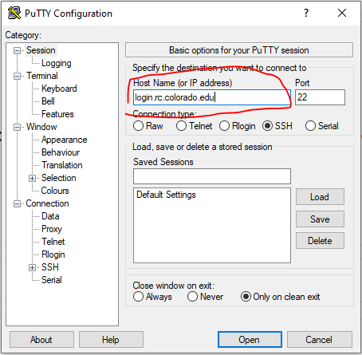
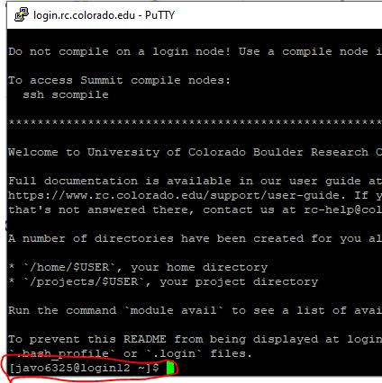
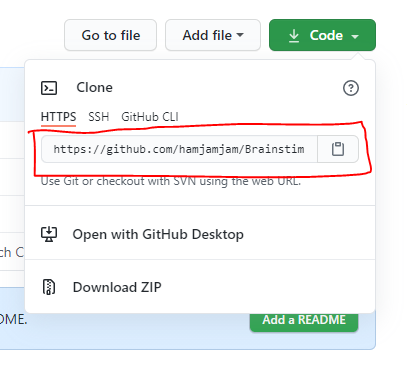
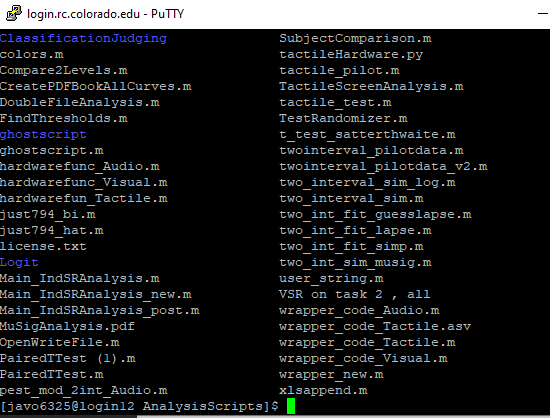
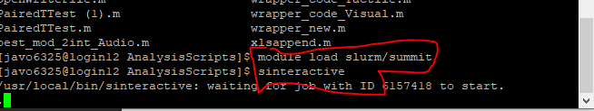
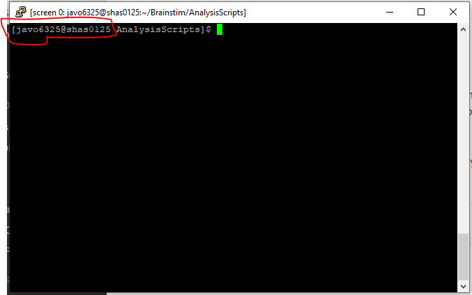
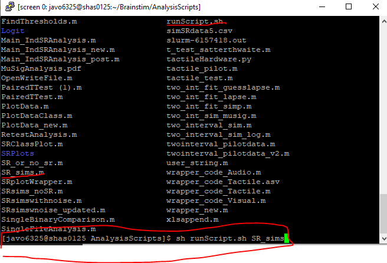

# How to run Matlab Scripts on CU's Research Computing Resources (from Windows)

There is a lot of information [here](https://curc.readthedocs.io/en/latest/software/matlab.html)

For when I forget the details:

## Getting an account
First request an account at [the RC website](https://rcamp.rc.colorado.edu/accounts/account-request/create/organization)
Unfortunately, it requires duo.

## Logging in
Next, follow the steps [here](https://curc.readthedocs.io/en/latest/access/logging-in.html) to download Putty and sign in.



Essentially, open Putty and under “Host Name (or IP address)”, enter `login.rc.colorado.edu`. Select “SSH” as the connection type. Click on “Open”.

This will bring you to a login node - basically, it is a machine (or VM) on the RC network that is for logging in and nothing else. In order to run anything, we need to submit a job.



## Getting your Matlab Scripts onto the Machine
Great - now in order to run our Matlab scripts, we need to pull them into the environment. I have been using github to host this Brainstim repo. If you go to the main repo and hit the big green 'Code' button, it will give you a few options.



Copy the 'HTTPS' line and then go back to Putty and run:

`git clone <<what you copied>>`

If your repo is private, you may be prompted for your github credentials. Note that when you type in a password, nothing will appear on the screen.

You can now use the `cd` command to access your files.

`cd <<repo name>>`

will take you into your repo (hopefully containing your Matlab scripts).



## Submitting a job to an interactive node
There are steps [here](https://curc.readthedocs.io/en/latest/software/matlab.html) to run matlab scripts.



First, we need to get set up to submit. We do this by running the following two commands.

```
module load slurm/summit
sinteractive
```

This will move us away from the login node.



## Running the scripts
Next, we want to run our Matlab scripts. In order to do this a little more easily, I have left a 'runScripts.sh' file in the Analysis Scripts folder. Here is how you use it:

`sh runScript.sh filename`

Note that no `.m` is needed.

We are running Matlab without a gui. You will need to have written your matlab script to output what you want to a file (e.g. a .mat, .csv or .pdf). You will not be able to save anything that is just left in the workspace.



## Saving your outputs

Once your script is done running, you can look at the environment variables with `whos`. You can then you standard matlab commands to look at what you have and confirm that your script ran correctly. Once you are happy with it, type:

`exit`

to exit Matlab. Now you want to upload your output files to github! We do this with the following:

`git add --all`

This will tell git that you want to keep all the changes you made (if you don't you can call `git add filename` for each file that you DO want to keep the changes of)

Next:

`git commit -m "your message here"`

This will commit the files you told git to add and will save a message (like 'ran simulations, got output'). Lastly, we want to push this to github:

`git push`

You will be prompted for github credentials.
